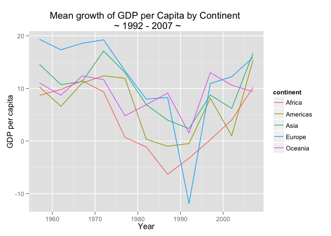
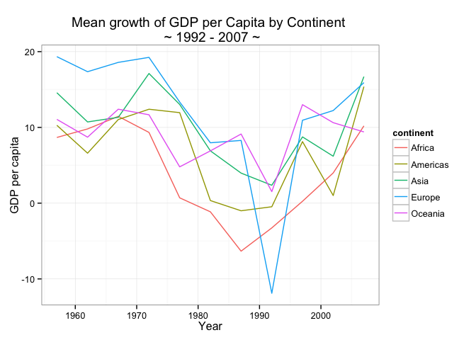

___


___

# Table of contents
1. [<font color="blue">Week 1 - Getting familiar with Git and R</font>](#Week 1)
	* [Week 1 Tasks](#tasks_week1)
2. [<font color="blue">Week 2 - Data Exploration</font>](#Week 2)
	* [dplyr](#dplyr)
		* [<font color="orange">dplyr Challenge</font>](#challenge_dplyr)
	* [Group Project](#groupProject1)
3. [<font color="blue">Week 3 - Visualisation</font>](#Week 3)
	* [ggplot2](#ggplot2)
		* [<font color="orange">ggplot Challenge</font>](#challenge_ggplot)
	* [rCharts](#rCharts)
		* [<font color="orange">rCharts Challenge</font>](#challenge_rCharts)
	* [Shiny](#Shiny)
	* [Week 3 Tasks & Group Work](#tasks_week3)
	* [<font color="green">Left of the Dot Consulting Project</font>](#lotd)


# Week 1 - Getting familiar with Git and R <a name="Week 1"></a>

Slides: [Intro to R and Git](https://htmlpreview.github.io/?https://github.com/AQM-UBC/CourseMaterial/blob/master/Week1_Setup/slides01_Intro.html)

Let's get familiar with some of the tools we will be using for a large portion of AQM:

1. [Slack](https://slack.com/) - Our private chat-room
2. [Git](http://www.git-scm.com/) & [Github](https://github.com/) - Remind me to add you to our private AQM organisation
3. [R](https://www.r-project.org/) with [Rstudio](https://www.rstudio.com/)

Please follow along with these slides to get more acquainted: Intro_slides

In order to get set-up, please follow the steps below:

1. [Install R](http://cran.stat.sfu.ca/) - this is the fundamental R statistical language
2. [Install Rstudio](https://www.rstudio.com/products/rstudio/download/) - this is a nice UI for R. Make sure to get the most up-to-date version for your platform.
3. [Install Git](http://git-scm.com/) - make sure you can save your work progress with this time-capsule. 
	* **For Windows users, please install [git for Windows](https://git-for-windows.github.io/), as you will require the git bash that it comes with.**
4. Set-up a [Github account](https://github.com/)
5. Get a [free student account](https://education.github.com/)

Now comes the tricky part, which is getting your local git to communicate with Github. We will be using the command user interface for our git operations, so take some time to get familiar with basic [bash shell navigation](http://www.linuxcommand.org/lts0020.php).

1. Open terminal (Mac users) or git bash (Windows users) and type in the following, which correspond to your Github credentials:


```r
git config --global user.name "YOUR NAME"
git config --global user.email "YOUR EMAIL ADDRESS"
```

2. Generate an SSH key - this is a secure method to identify and connect to your Github repository without the need to use a password each time. [Follow the tutorial](https://help.github.com/articles/generating-ssh-keys/).

3. Now we can communicate! Please follow [these instructions](http://rogerdudler.github.io/git-guide/) to become a git user. Skip the setup part, since you already completed that above ;)

<br>

#### Tasks to complete for next week <a name="tasks_week1"></a>

* _Follow the walkthrough [here](https://github.com/AQM-UBC/CourseMaterial/raw/master/Week1_Setup/SetupWalkthrough.pdf)._

* _Complete the tutorials and tasks for next week: [Work_for_Wednesday.pdf](https://github.com/AQM-UBC/CourseMaterial/raw/master/Week2_Exploration/Work_for_Wednesday.pdf)_

Create and push a personal `README.md` file to your repository telling us about yourself and what steps you took to push your `README.md` to your Github repository. You must include the following in your `README.md`: 
	* _italics_, **BOLD**, etc.
	* A header (try different levels)
	* Bullet points and numbering
	* An image of your choice

Be advised, that when you clone your repo, a `README.md` has already been created, so modify that. If you do not have a `README.md`, you will create a new R Markdown file, and add it into the git directory. We must add the following (exact spacing necessary) to the YAML front matter (descriptive chunk at the top) in order to get this `.Rmd` to convert to a `.md`:


```r
output:
    html_document:
        keep_md:true
```

When anyone decides to peek at your repository, the ``README.md`` will instruct them what it is about. Basically, it acts as a landing page for one of your repos. Use the [Markdown Cheatsheet](http://assemble.io/docs/Cheatsheet-Markdown.html) for examples and syntax.

<br>
<br>
<br>
<br>

# Week 2 - Data Exploration <a name="Week 2"></a>

___
**Slides:** [Intro to data exploration](https://htmlpreview.github.io/?https://github.com/AQM-UBC/CourseMaterial/blob/master/Week2_Exploration/index.html)

**Google page-rank algorithm:** [Slides](Week2_Exploration/R_intro.pdf) - [Source](Week2_Exploration/moneymaker.R)

**Please check out** [Introduction to dplyr](https://cran.rstudio.com/web/packages/dplyr/vignettes/introduction.html)

___

We begin to explore `data.frames` using simple functions that give us a brief understanding of what the data entails:

* `dim()`, `nrow()`, `ncol()`
* `str()`
* `is.data.frame()`, `is.matrix()`, `is.vector()`, etc.
* `summary()`

### dplyr <a name="dplyr"></a>

We then delved into the powerful dplyr package. Remember, `data.frames` are special forms of data objects in R that enable us to combine numerical, factor, string, and other types of data together. A simple matrix cannot combine different types of data, as we saw in class. We covered useful dplyr "verbs" that perform routine operations on your data, including:

* `select()` - select the variables (columns) of the data you are interested in.
* `filter()` - filter the rows of the data.frame utilising your logical operators `>`,`<`,`>=`,`<=`, and `==` .
* `group_by()` - group the data according to some category, for instance, group all data by continent.
* `mutate()` - mutate or transform one variable into another using some function. For example, create a new variable (column) that is a combination of two other variables (population and GDP).
* `summarise()`  - Summarise multiple values to a single value. For example, the mean GDP or total GDP of each continent, where the continent group was created using the function `group_by()`.

We also learned about the use of the piping commands `%>%`, using `command⌘+shift+m,` making data wrangling intuitive and easy. Here's a n example:

<br>

#### Challenge: Can you find the world growth of GDP per Capita in 1997? <a name="challenge_dplyr"></a>

I would just like to **select** the year, continent and gdpPercap variables from the gapminder data object, **mutate** gdpPercap into a new variable (column) called change (rate of change of gdpPercap), **filter** all years greater (but not equal to) 1952 (why?), **group_by year**, and **summarize** the data by the mean rate of change of gdpPercap per the grouped category, year.


```r
gdp.delta <- gapminder %>%
    select(year, continent, gdpPercap) %>%
    mutate(change = 100*((gdpPercap - lag(gdpPercap)))/gdpPercap) %>%
    filter(year > 1952) %>%
    group_by(year) %>%
    summarise(gdp_delta = mean(change))
```

The result is an object `gdp.delta` with the mean rate of change of GDP per Capita for each year (5-year lag), as below:


 year    gdp_delta  
------  ------------
 1957    12.6140175 
 1962    11.0293491 
 1967    12.8726900 
 1972    13.8092669 
 1977    8.2764706  
 1982    3.0273164  
 1987    0.3031941  
 1992    -3.2216599 
 1997    6.0489270  
 2002    5.8104172  
 2007    13.8184345 

<br>

#### Group Project <a name="groupProject1"></a>

Time for the first group project! Hopefully you remember your number from Wednesday. This will be due **Wednesday, November 4th**.

Your data choices for this project are given below (mind the file formats):

1. [Gapminder.tsv](https://raw.githubusercontent.com/AQM-UBC/CourseMaterial/master/Week2_Exploration/Data/gapminder.tsv)

> _If your choice is Gapminder, please learn more [here](https://github.com/jennybc/gapminder)._

2. [Aquisitions.csv](https://raw.githubusercontent.com/AQM-UBC/CourseMaterial/master/Week2_Exploration/Data/CrunchBase/Aquisitions.csv)
3. [Companies.csv](https://raw.githubusercontent.com/AQM-UBC/CourseMaterial/master/Week2_Exploration/Data/CrunchBase/Companies.csv)
4. [Investment.csv](https://raw.githubusercontent.com/AQM-UBC/CourseMaterial/master/Week2_Exploration/Data/CrunchBase/Investment.csv)
5. [Rounds.csv](https://raw.githubusercontent.com/AQM-UBC/CourseMaterial/master/Week2_Exploration/Data/CrunchBase/Rounds.csv)

> _The other data sets come from [Crunchbase](https://modeanalytics.com/crunchbase). You can use any on of the data sets, but if you're up for a challenge, these data have commonalities and can be combined using operations provided in the slides provided above. "[Crunchbase](https://modeanalytics.com/crunchbase) is quickly becoming the dataset of record for the startup and venture capital communities. It can provide information on anything from what industries are hot (biotech) to the potential effects of founder experience or age. The dataset includes funding, investment, and acquisition data on over 40,000 companies"._ 

**Objective:** Refine your data exploration skills using simple functions and identify some interesting features using the dplyr "verbs" and pipelines. My recommendation is to come up with a hypothesis of a certain phenomenon, allocate certain aspects amongst group members, then use your newly aquired data wrangling skills to accept/reject your hypothesis. Did you find something else interesting in the process?

**Expectations:** An objective was established, all members contributed to obtaining that objective, and a presentation regarding your group's findings will be delivered, involving each member of the group.

<br>
<br>
<br>
<br>

# Week 3 - Visualisation  <a name="Week 3"></a>

___

So we can manipulate data and attempt to find some patterns, but visualisations make the much easier. It also makes a large difference when presenting your findings to a group of clients or your boss. This week we will delve into ggplot2, rCharts and if all goes well, Shiny! 

<br>

### <font color="orange">ggplot2</font>  <a name="ggplot2"></a>
By the same creator of your favourite dplyr package, ggplot2 easily extends your wrangled data.frames to eye-pleasing visualisations. The syntax is quite simple:

<font size=5>
**`myPlot <- ggplot(data.frame.object, aes(x = ?, y = ?, ...)) + ...`**
</font>

1. Think of a descriptive plot name (myPlot is not!)
	* let's say `asia.lifeExp.perYear`
<br><br>
2. Input some data.frame object in [long form](http://stackoverflow.com/questions/5877234/r-transforming-short-form-data-to-long-form-data-without-for-loops)
<br><br>
3. Specify aesthetics, which you can think of as the properties required to construct your plot (x, y, colour, etc). Multiple aesthetics can add other dimensions of information to the plot.
	* `asia.lifeExp.perYear <- ggplot(df, aes(x = year, y = lifeExp, colour = country))`
<br><br>
4. Add layers - layers are known as **geoms**
	* `asia.lifeExp.perYear_2 <- asia.lifeExp.perYear + geom_line() + ggtitle("your title")`
	* There are many different geom layers you can choose from (points, lines, densityies, ...). Check them all out [here](http://docs.ggplot2.org/current/).
	* Remember to `?` the geom of your chose to understand more about it!
<br><br>
5. Save that plot to a directory
	* Once your plot is ready-to-go, save it to a directory and use it wherever you like: `ggsave(your_plot_name, filename = "the filename of the plot")`

<br>

#### Challenge: Can you find which continent has the lowest mean growth of GDP per Capita in 1992? <a name="challenge_ggplot"></a>

Let's extend the question from week 2, but this time, let's answer the question with a ggplot visual!


```r
# load library
library(ggplot2)

# wrangle that data with dplyr and group
# settings will extend to the plot!
gdp.delta.new <- gapminder %>%
    select(year, continent, country, gdpPercap) %>%
    mutate(change = 100*((gdpPercap - lag(gdpPercap)))/gdpPercap) %>%
    filter(year > 1952) %>%
    group_by(continent, year) %>%
		summarise(mean.growth = mean(change))

# construct the plot frame
plot.frame <- ggplot(gdp.delta.new, aes(x = year, y = mean.growth))

# add a point layer
plot2 <- plot.frame + geom_line(aes(colour = continent))

# add axis labels and a title
plot3 <- plot2 + 
	ggtitle("Mean growth of GDP per Capita by Continent \n ~ 1992 - 2007 ~") +
	xlab("Year") + ylab("Life Expectancy")

# print the plot
print(plot3)
```

 

We can now simply say that the largest drop in mean growth occurred in Europe in 1992 without looking at a bunch of data! Although, it's best to accompany your plot with a data table. So, now you can answer the question of what caused this drop in the first place... any ideas?

We can make the plot look even prettier or simplistic or adjust the legend by adjusting the themes.


```r
# remove the clutter
plot4 <- plot3 + theme_bw()
print(plot4)
```

 

Please follow along with the following examples and tutorials to improve those ggplot skills:

* Try these [ggplot challenges](https://htmlpreview.github.io/?https://github.com/AQM-UBC/CourseMaterial/blob/master/Week3_Visualisation/ggplot_challenges.html)
* Check out the [ggplot2 graphics cookbook](http://www.cookbook-r.com/Graphs/index.html)
* Keep things interesting with ggplot2 [themes](http://docs.ggplot2.org/dev/vignettes/themes.html)
* A bunch of tutorials on [different types of visualisations with ggplot2](http://docs.ggplot2.org/current/)
* Of course, [Google](google.ca) and [Stack Overflow](http://stackoverflow.com/tags/ggplot2) will have most of your answers

<br>

### <font color="blue">rCharts</font> <a name="rCharts"></a>

"rCharts is an R package to create, customize and publish interactive javascript visualizations from R using a familiar lattice style plotting interface."

Basically, you can develop sophistocated, interactive visualisations from your very own Rstudio with little effort! The syntax is not much different from ggplot2, so its a nice tool to add to our pouch. Check out the [official page](http://rcharts.io/). There are many plottin libraries to use to make your visualisations really stand out - [view them all here](http://rcharts.io/gallery/).

To [get started](http://ramnathv.github.io/rCharts/), you need to install the following package(s):


```r
install.packages("devtools") # if you haven't already

library(devtools)
install_github('ramnathv/rCharts')
```

The package **[devtools](https://www.rstudio.com/products/rpackages/devtools/)** has alot to offer, but in this case, it will enable us to install packages from other's Github repositories - so Cran is not the only place to go for packages.

As with anything in this course, let's dive into an example using a [stackedAreaChart](http://walkerke.github.io/2014/08/un-projections/):

<br>


```r
library(rCharts)
library(RColorBrewer) # for pretty colours

# wrangle with your typical dplyr
dat <- gapminder %>%
	group_by(continent, year) %>%
	filter(continent != "Oceania") %>% # why do I remove Oceania?
	summarise(mean.lifeExp = mean(lifeExp)) %>%
	select(continent, mean.lifeExp, year)

# create the plot
c1 <- nPlot(mean.lifeExp ~ year, 
            group = "continent", 
            data = dat, 
            type = "stackedAreaChart")

# add the so called "aesthetics" or properties
c1$chart(color = brewer.pal(6, "Set2")) # colour from RColorBrewer library
c1$yAxis(tickFormat= "#!d3.format(',.1f')!#")
c1$yAxis(axisLabel = "Life Expectancy", width = 62)
c1$xAxis(axisLabel = "Year")
c1$chart(tooltipContent = "#! function(key, x, y){
        return '<h3>' + key + '</h3>' + 
        '<p>' + y + ' years ' + x + '</p>'
        } !#")
```

<br>

<iframe src=' http://rcharts.io/viewer/?d6b179733e66f0432f39#.Vjpx_aIqSbg ' scrolling='no' frameBorder='0' seamless class='rChart nvd3 ' id=iframe- chart7087967579 ></iframe> <style>iframe.rChart{ width: 100%; height: 400px;}</style>

<br>

This [stackedAreaChart](http://walkerke.github.io/2014/08/un-projections/) shows the _cumulative_ life expectancy for each continent stacked one on top of the other. It may not be too practice, but makes for a pretty visualisation. Let's try one that would be useful:

<br>

<iframe src=' http://rcharts.github.io/viewer/?68ff32b612fb229dd7cc ' scrolling='no' frameBorder='0' seamless class='rChart nvd3 ' id=iframe- chart7087967579 ></iframe> <style>iframe.rChart{ width: 100%; height: 500px;}</style>

<br>

Check out the Gapminder implementation of the code for this one below (it's just a modification of the original code. Only adjust the legend title in the script as I did):


```r
gap <- gapminder %>% filter(year == 1977)

d1 <- dPlot(
  gdpPercap~lifeExp,
  groups = c("country", "year", "continent"),
  data = gap,
  type = "bubble",
  height = 380,
  width = 590,
  bounds = list(x=60, y=30, width=420, height=310),
  xlab = "Life Expectancy", #example of a custom x label
  ylab = "GDP per capita"
)
d1$xAxis( type = "addMeasureAxis" )
d1$yAxis( type = "addMeasureAxis" )
d1$legend(
  x = 530,
  y = 100,
  width = 60,
  height = 300,
  horizontalAlign = "right"
)

d1$setTemplate(
  afterScript = 
'<script>
          myChart.axes.filter(function(ax){return ax.position == "x"})[0].titleShape.text(opts.xlab)
          myChart.axes.filter(function(ax){return ax.position == "y"})[0].titleShape.text(opts.ylab)
        // This is a critical step.  By doing this we orphan the legend. This
        // means it will not respond to graph updates.  Without this the legend
        // will redraw when the chart refreshes removing the unchecked item and
        // also dropping the events we define below.
        myChart.legends = [];
        // This block simply adds the legend title. I put it into a d3 data
        // object to split it onto 2 lines.  This technique works with any
        // number of lines, it isn\'t dimple specific.
        svg.selectAll("title_text")
          .data(["Continent","click to show/hide:"])
          .enter()
          .append("text")
            .attr("x", 499)
            .attr("y", function (d, i) { return 90 + i * 14; })
            .style("font-family", "sans-serif")
            .style("font-size", "10px")
            .style("color", "Black")
            .text(function (d) { return d; });
        // Get a unique list of continent values to use when filtering
        var filterValues = dimple.getUniqueValues(data, "continent");
        // Get all the rectangles from our now orphaned legend
        l.shapes.selectAll("rect")
          // Add a click event to each rectangle
          .on("click", function (e) {
            // This indicates whether the item is already visible or not
            var hide = false;
            var newFilters = [];
            // If the filters contain the clicked shape hide it
            filterValues.forEach(function (f) {
              if (f === e.aggField.slice(-1)[0]) {
                hide = true;
              } else {
                newFilters.push(f);
              }
            });
            // Hide the shape or show it
            if (hide) {
              d3.select(this).style("opacity", 0.2);
            } else {
              newFilters.push(e.aggField.slice(-1)[0]);
              d3.select(this).style("opacity", 0.8);
            }
            // Update the filters
            filterValues = newFilters;
            // Filter the data
            myChart.data = dimple.filterData(data, "continent", filterValues);
            // Passing a duration parameter makes the chart animate. Without
            // it there is no transition
            myChart.draw(800);
          myChart.axes.filter(function(ax){return ax.position == "x"})[0].titleShape.text(opts.xlab)
          myChart.axes.filter(function(ax){return ax.position == "y"})[0].titleShape.text(opts.ylab)
            });
  </script>'
)
```


<br>

##### CHALLENGE: Recreate the plot above from one of the templates provided on the site using the trusty Gapminder data set. <a name="challenge_rCharts"></a>

<br>

### <font color="magenta">Shiny</font> <a name="Shiny"></a>

Welcome to Shiny, where you can make wonderfully looking jave-based apps in a fraction of the time. Shiny uses what is known as [ractive programming](https://en.wikipedia.org/wiki/Reactive_programming). Shiny apps have two components:

* a user-interface script
* a server script

"The user-interface (ui) script controls the layout and appearance of your app. It is defined in a source script named ui.R. The server.R script contains the instructions that your computer needs to build your app."

First, let's begin by installing shiny:


```r
install.packages("shiny")
```

Then check out an example to see how it works:


```r
library(shiny)
runExample("01_hello")
```

The best way to learn, rather than me reiterating everything, is to follow along with this [tutorial](http://shiny.rstudio.com/).

<br>

#### Tasks for next week <a name="tasks_week3"></a>

1. Create a `README.md` file for your group repository. You will need different sub-folders in your group repository for different projects, each with a specific `README.md` landing page. Your main `README.md` for the repo should be a directory or "table of contents" linking each project folder. Structure it similar to [Jenny's repo here](https://github.com/jennybc/ggplot2-tutorial). Jenny is a very notable Statistics prof from UBC focussing on data visualisation!
<br><br>
In your `README.md`, please cover your group's hypothesis, results obtained and any other interesting points you came across. You are required to include 2 ggplots in your `README.md` to convey your results and exploratory research accompanied with 2 tables reinforcing the ggplots. For producing nice tables in R and Markdown, check out the package [KnitR](http://kbroman.org/knitr_knutshell/).

2. From your project above, create an interactive [rChart](http://rcharts.io/) to demonstrate to the class next week. Just select a template from the [rCharts Gallery](http://rcharts.io/gallery/) that suits your data visualisation needs and conform it to fit your data (some problem solving skills required). 

3. Begin walking through the Shiny tutorial given above for an intro to constructing R apps. Follow along to the point where you finish and test one of the apps they provide in the tutorial for yourself.

#### <font color="green">Left of the Dot Consulting Project</font> <a name="lotd"></a>

Get back into your project groups, create a new subfolder within your group repo, and query from Left of the Dot's PostgreSQL database. Check the code he added to the _Slack General_ page. Your job is similar to the last - form a hypothesis and begin exploring that data with your added visualisation skills! Check out this helpful [tutorial](http://www.r-bloggers.com/r-and-postgresql-using-rpostgresql-and-sqldf/). We will have a milestone check next week when we decide to meet. For further discussion and material about our consulting engagement, please refer to our private means of communication (Slack and/or AQM Github Organisation).

<br>
<br>


