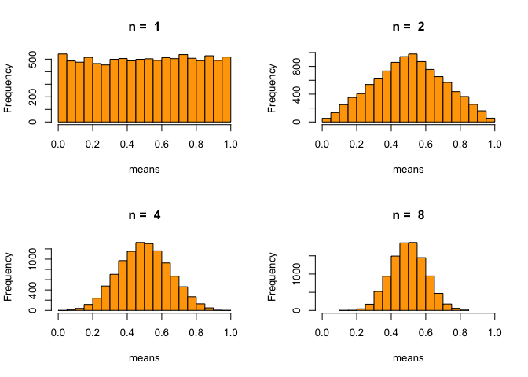
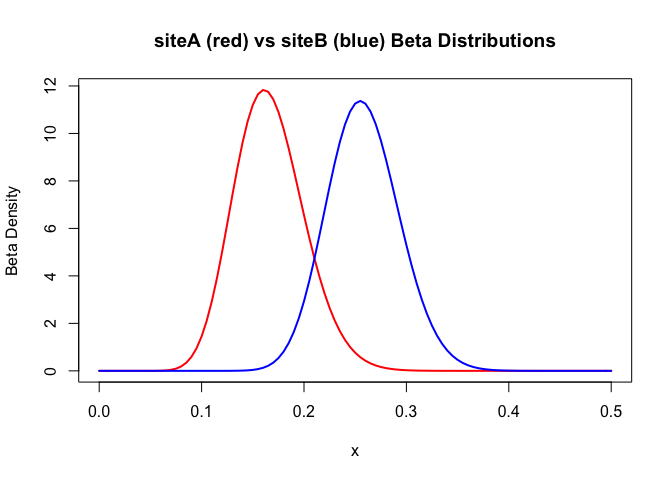

___


___

# Table of Contents

___

* [<font color="blue">Getting familiar with Git and R</font>](#git&R)
	* [Week 1 Tasks](#tasks_week1)
* [<font color="blue">Data Exploration</font>](#exploration)
	* [dplyr](#dplyr)
		* [<font color="orange">dplyr Challenge</font>](#challenge_dplyr)
	* [Group Project](#groupProject1)
* [<font color="blue">Visualisation</font>](#visualisation)
	* [ggplot2](#ggplot2)
		* [<font color="orange">ggplot Challenge</font>](#challenge_ggplot)
	* [rCharts](#rCharts)
		* [<font color="orange">rCharts Challenge</font>](#challenge_rCharts)
	* [Shiny](#Shiny)
	* [Week 3 Tasks & Group Work](#tasks_week3)
* [<font color="green">Left of the Dot Capstone Project</font>](#lotd)
	* [Working with databases through R](#database)
* [<font color="blue">Linear Algebra</font>](#linearAlgebra)
* [<font color="blue">Probability</font>](#probability)
	* [Intro to Probability](#prob)
* [<font color="blue">Applied Probability</font>](#appliedProbability)
	* [How do we use probaility to model data?](#probIntro)
	* [Fitting a distribution to Global Bank Capital to Assets Ratio](#GDP)
* [<font color="blue">Monte Carlo Simulation</font>](#simulation)
	* [Simulating P-values](#pvals)
	* [Frequency and Probability of Coin Flips](#coinFlips)
	* [How many runs of 6 heads can I expect after 1000 flips?](#runsof6)
* [<font color="blue">Regression</font>](#regression)
	
<br>
<br>
<br>
<br>

___

# Getting familiar with Git and R <a name="git&R"></a>

___

Slides: [Intro to R and Git](https://htmlpreview.github.io/?https://github.com/AQM-UBC/CourseMaterial/blob/master/Week1_Setup/slides01_Intro.html)

Let's get familiar with some of the tools we will be using for a large portion of AQM:

1. [Slack](https://slack.com/) - Our private chat-room
2. [Git](http://www.git-scm.com/) & [Github](https://github.com/) - Remind me to add you to our private AQM organisation
3. [R](https://www.r-project.org/) with [Rstudio](https://www.rstudio.com/)

Please follow along with these slides to get more acquainted: Intro_slides

In order to get set-up, please follow the steps below:

1. [Install R](http://cran.stat.sfu.ca/) - this is the fundamental R statistical language
2. [Install Rstudio](https://www.rstudio.com/products/rstudio/download/) - this is a nice UI for R. Make sure to get the most up-to-date version for your platform.
3. [Install Git](http://git-scm.com/) - make sure you can save your work progress with this time-capsule. 
	* **For Windows users, please install [git for Windows](https://git-for-windows.github.io/), as you will require the git bash that it comes with.**
4. Set-up a [Github account](https://github.com/)
5. Get a [free student account](https://education.github.com/)

Now comes the tricky part, which is getting your local git to communicate with Github. We will be using the command user interface for our git operations, so take some time to get familiar with basic [bash shell navigation](http://www.linuxcommand.org/lts0020.php).

1. Open terminal (Mac users) or git bash (Windows users) and type in the following, which correspond to your Github credentials:


```r
git config --global user.name "YOUR NAME"
git config --global user.email "YOUR EMAIL ADDRESS"
```

2. Generate an SSH key - this is a secure method to identify and connect to your Github repository without the need to use a password each time. [Follow the tutorial](https://help.github.com/articles/generating-ssh-keys/).

3. Now we can communicate! Please follow [these instructions](http://rogerdudler.github.io/git-guide/) to become a git user. Skip the setup part, since you already completed that above ;)

<br>

#### Tasks to complete for next week <a name="tasks_week1"></a>

* _Follow the walkthrough [here](https://github.com/AQM-UBC/CourseMaterial/raw/master/Week1_Setup/SetupWalkthrough.pdf)._

* _Complete the tutorials and tasks for next week: [Work_for_Wednesday.pdf](https://github.com/AQM-UBC/CourseMaterial/raw/master/Week2_Exploration/Work_for_Wednesday.pdf)_

Create and push a personal `README.md` file to your repository telling us about yourself and what steps you took to push your `README.md` to your Github repository. You must include the following in your `README.md`: 

* _italics_, **BOLD**, etc.
* A header (try different levels)
* Bullet points and numbering
* An image of your choice

Be advised, that when you clone your repo, a `README.md` has already been created, so modify that. If you do not have a `README.md`, you will create a new R Markdown file, and add it into the git directory. We must add the following (exact spacing necessary) to the YAML front matter (descriptive chunk at the top) in order to get this `.Rmd` to convert to a `.md`:


```r
output:
    html_document:
        keep_md:true
```

When anyone decides to peek at your repository, the ``README.md`` will instruct them what it is about. Basically, it acts as a landing page for one of your repos. Use the [Markdown Cheatsheet](http://assemble.io/docs/Cheatsheet-Markdown.html) for examples and syntax.

<br>
<br>
<br>
<br>

___

# Data Exploration <a name="exploration"></a>

___
**Slides:** [Intro to data exploration](https://htmlpreview.github.io/?https://github.com/AQM-UBC/CourseMaterial/blob/master/Week2_Exploration/index.html)

**Google page-rank algorithm:** [Slides](Week2_Exploration/R_intro.pdf) - [Source](Week2_Exploration/moneymaker.R)

**Please check out** [Introduction to dplyr](https://cran.rstudio.com/web/packages/dplyr/vignettes/introduction.html)

___

We begin to explore `data.frames` using simple functions that give us a brief understanding of what the data entails:

* `dim()`, `nrow()`, `ncol()`
* `str()`
* `is.data.frame()`, `is.matrix()`, `is.vector()`, etc.
* `summary()`

### dplyr <a name="dplyr"></a>

We then delved into the powerful dplyr package. Remember, `data.frames` are special forms of data objects in R that enable us to combine numerical, factor, string, and other types of data together. A simple matrix cannot combine different types of data, as we saw in class. We covered useful dplyr "verbs" that perform routine operations on your data, including:

* `select()` - select the variables (columns) of the data you are interested in.
* `filter()` - filter the rows of the data.frame utilising your logical operators `>`,`<`,`>=`,`<=`, and `==` .
* `group_by()` - group the data according to some category, for instance, group all data by continent.
* `mutate()` - mutate or transform one variable into another using some function. For example, create a new variable (column) that is a combination of two other variables (population and GDP).
* `summarise()`  - Summarise multiple values to a single value. For example, the mean GDP or total GDP of each continent, where the continent group was created using the function `group_by()`.

We also learned about the use of the piping commands `%>%`, using `command⌘+shift+m,` making data wrangling intuitive and easy. Here's a n example:

<br>

#### Challenge: Can you find the world growth of GDP per Capita in 1997? <a name="challenge_dplyr"></a>

I would just like to **select** the year, continent and gdpPercap variables from the gapminder data object, **mutate** gdpPercap into a new variable (column) called change (rate of change of gdpPercap), **filter** all years greater (but not equal to) 1952 (why?), **group_by year**, and **summarize** the data by the mean rate of change of gdpPercap per the grouped category, year.


```r
gdp.delta <- gapminder %>%
    select(year, continent, gdpPercap) %>%
    mutate(change = 100*((gdpPercap - lag(gdpPercap)))/gdpPercap) %>%
    filter(year > 1952) %>%
    group_by(year) %>%
    summarise(gdp_delta = mean(change))
```

The result is an object `gdp.delta` with the mean rate of change of GDP per Capita for each year (5-year lag), as below:


 year    gdp_delta  
------  ------------
 1957    12.6140175 
 1962    11.0293491 
 1967    12.8726900 
 1972    13.8092669 
 1977    8.2764706  
 1982    3.0273164  
 1987    0.3031941  
 1992    -3.2216599 
 1997    6.0489270  
 2002    5.8104172  
 2007    13.8184345 

<br>

#### Group Project <a name="groupProject1"></a>

Time for the first group project! Hopefully you remember your number from Wednesday. This will be due **Wednesday, November 4th**.

Your data choices for this project are given below (mind the file formats):

1. [Gapminder.tsv](https://raw.githubusercontent.com/AQM-UBC/CourseMaterial/master/Week2_Exploration/Data/gapminder.tsv)

> <font size=2>If your choice is Gapminder, please learn more [here](https://github.com/jennybc/gapminder). </font>

2. [Aquisitions.csv](https://raw.githubusercontent.com/AQM-UBC/CourseMaterial/master/Week2_Exploration/Data/CrunchBase/Aquisitions.csv)
3. [Companies.csv](https://raw.githubusercontent.com/AQM-UBC/CourseMaterial/master/Week2_Exploration/Data/CrunchBase/Companies.csv)
4. [Investment.csv](https://raw.githubusercontent.com/AQM-UBC/CourseMaterial/master/Week2_Exploration/Data/CrunchBase/Investment.csv)
5. [Rounds.csv](https://raw.githubusercontent.com/AQM-UBC/CourseMaterial/master/Week2_Exploration/Data/CrunchBase/Rounds.csv)

> <font size=2>The other data sets come from [Crunchbase](https://modeanalytics.com/crunchbase). You can use any on of the data sets, but if you're up for a challenge, these data have commonalities and can be combined using operations provided in the slides provided above. "[Crunchbase](https://modeanalytics.com/crunchbase) is quickly becoming the dataset of record for the startup and venture capital communities. It can provide information on anything from what industries are hot (biotech) to the potential effects of founder experience or age. The dataset includes funding, investment, and acquisition data on over 40,000 companies".</font>

**Objective:** Refine your data exploration skills using simple functions and identify some interesting features using the dplyr "verbs" and pipelines. My recommendation is to come up with a hypothesis of a certain phenomenon, allocate certain aspects amongst group members, then use your newly aquired data wrangling skills to accept/reject your hypothesis. Did you find something else interesting in the process?

**Expectations:** An objective was established, all members contributed to obtaining that objective, and a presentation regarding your group's findings will be delivered, involving each member of the group.

<br>
<br>
<br>
<br>

___

# Visualisation  <a name="visualisation"></a>

___

So we can manipulate data and attempt to find some patterns, but visualisations make the much easier. It also makes a large difference when presenting your findings to a group of clients or your boss. This week we will delve into ggplot2, rCharts and if all goes well, Shiny! 

<br>

### <font color="orange">ggplot2</font>  <a name="ggplot2"></a>
By the same creator of your favourite dplyr package, ggplot2 easily extends your wrangled data.frames to eye-pleasing visualisations. The syntax is quite simple:

<font size=5>
**`myPlot <- ggplot(data.frame.object, aes(x = ?, y = ?, ...)) + ...`**
</font>

1. Think of a descriptive plot name (myPlot is not!)
	* let's say `asia.lifeExp.perYear`
<br><br>
2. Input some data.frame object in [long form](http://stackoverflow.com/questions/5877234/r-transforming-short-form-data-to-long-form-data-without-for-loops)
<br><br>
3. Specify aesthetics, which you can think of as the properties required to construct your plot (x, y, colour, etc). Multiple aesthetics can add other dimensions of information to the plot.
	* `asia.lifeExp.perYear <- ggplot(df, aes(x = year, y = lifeExp, colour = country))`
<br><br>
4. Add layers - layers are known as **geoms**
	* `asia.lifeExp.perYear_2 <- asia.lifeExp.perYear + geom_line() + ggtitle("your title")`
	* There are many different geom layers you can choose from (points, lines, densityies, ...). Check them all out [here](http://docs.ggplot2.org/current/).
	* Remember to `?` the geom of your chose to understand more about it!
<br><br>
5. Save that plot to a directory
	* Once your plot is ready-to-go, save it to a directory and use it wherever you like: `ggsave(your_plot_name, filename = "the filename of the plot")`

<br>

#### Challenge: Can you find which continent has the lowest mean growth of GDP per Capita in 1992? <a name="challenge_ggplot"></a>

Let's extend the question from week 2, but this time, let's answer the question with a ggplot visual!


```r
# load library
library(ggplot2)

# wrangle that data with dplyr and group
# settings will extend to the plot!
gdp.delta.new <- gapminder %>%
    select(year, continent, country, gdpPercap) %>%
    mutate(change = 100*((gdpPercap - lag(gdpPercap)))/gdpPercap) %>%
    filter(year > 1952) %>%
    group_by(continent, year) %>%
		summarise(mean.growth = mean(change))

# construct the plot frame
plot.frame <- ggplot(gdp.delta.new, aes(x = year, y = mean.growth))

# add a point layer
plot2 <- plot.frame + geom_line(aes(colour = continent))

# add axis labels and a title
plot3 <- plot2 + 
	ggtitle("Mean growth of GDP per Capita by Continent \n ~ 1992 - 2007 ~") +
	xlab("Year") + ylab("GDP per capita")

# print the plot
print(plot3)
```

 

We can now simply say that the largest drop in mean growth occurred in Europe in 1992 without looking at a bunch of data! Although, it's best to accompany your plot with a data table. So, now you can answer the question of what caused this drop in the first place... any ideas?

We can make the plot look even prettier or simplistic or adjust the legend by adjusting the themes.


```r
# remove the clutter
plot4 <- plot3 + theme_bw()
print(plot4)
```

 

Please follow along with the following examples and tutorials to improve those ggplot skills:

* Try these [ggplot challenges](https://htmlpreview.github.io/?https://github.com/AQM-UBC/CourseMaterial/blob/master/Week3_Visualisation/ggplot_challenges.html)
* Check out the [ggplot2 graphics cookbook](http://www.cookbook-r.com/Graphs/index.html)
* Keep things interesting with ggplot2 [themes](http://docs.ggplot2.org/dev/vignettes/themes.html)
* A bunch of tutorials on [different types of visualisations with ggplot2](http://docs.ggplot2.org/current/)
* Of course, [Google](google.ca) and [Stack Overflow](http://stackoverflow.com/tags/ggplot2) will have most of your answers

<br>

### <font color="blue">rCharts</font> <a name="rCharts"></a>

"rCharts is an R package to create, customize and publish interactive javascript visualizations from R using a familiar lattice style plotting interface."

Basically, you can develop sophistocated, interactive visualisations from your very own Rstudio with little effort! The syntax is not much different from ggplot2, so its a nice tool to add to our pouch. Check out the [official page](http://rcharts.io/). There are many plottin libraries to use to make your visualisations really stand out - [view them all here](http://rcharts.io/gallery/).

To [get started](http://ramnathv.github.io/rCharts/), you need to install the following package(s):


```r
install.packages("devtools") # if you haven't already

library(devtools)
install_github('ramnathv/rCharts')
```

The package **[devtools](https://www.rstudio.com/products/rpackages/devtools/)** has alot to offer, but in this case, it will enable us to install packages from other's Github repositories - so Cran is not the only place to go for packages.

As with anything in this course, let's dive into an example using a [stackedAreaChart](http://walkerke.github.io/2014/08/un-projections/):

<br>


```r
library(rCharts)
library(RColorBrewer) # for pretty colours

# wrangle with your typical dplyr
dat <- gapminder %>%
	group_by(continent, year) %>%
	filter(continent != "Oceania") %>% # why do I remove Oceania?
	summarise(mean.lifeExp = mean(lifeExp)) %>%
	select(continent, mean.lifeExp, year)

# create the plot
c1 <- nPlot(mean.lifeExp ~ year, 
            group = "continent", 
            data = dat, 
            type = "stackedAreaChart")

# add the so called "aesthetics" or properties
c1$chart(color = brewer.pal(6, "Set2")) # colour from RColorBrewer library
c1$yAxis(tickFormat= "#!d3.format(',.1f')!#")
c1$yAxis(axisLabel = "Life Expectancy", width = 62)
c1$xAxis(axisLabel = "Year")
c1$chart(tooltipContent = "#! function(key, x, y){
        return '<h3>' + key + '</h3>' + 
        '<p>' + y + ' years ' + x + '</p>'
        } !#")
```

<br>

<iframe src=' http://rcharts.io/viewer/?d6b179733e66f0432f39#.Vjpx_aIqSbg ' scrolling='no' frameBorder='0' seamless class='rChart nvd3 ' id=iframe- chart7087967579 ></iframe> <style>iframe.rChart{ width: 100%; height: 400px;}</style>

<br>

This [stackedAreaChart](http://walkerke.github.io/2014/08/un-projections/) shows the _cumulative_ life expectancy for each continent stacked one on top of the other. It may not be too practice, but makes for a pretty visualisation. Let's try one that would be useful:

<br>

<iframe src=' http://rcharts.github.io/viewer/?68ff32b612fb229dd7cc ' scrolling='no' frameBorder='0' seamless class='rChart nvd3 ' id=iframe- chart7087967579 ></iframe> <style>iframe.rChart{ width: 100%; height: 500px;}</style>

<br>

##### CHALLENGE: Recreate the plot above from one of the templates provided on the site using the trusty Gapminder data set. <a name="challenge_rCharts"></a>

<br>

**ANSWER:** Check out the Gapminder implementation of the code for this one below (it's just a modification of the original code. Only adjust the legend title in the script as I did):


```r
gap <- gapminder %>% filter(year == 1977)

d1 <- dPlot(
  gdpPercap~lifeExp,
  groups = c("country", "year", "continent"),
  data = gap,
  type = "bubble",
  height = 380,
  width = 590,
  bounds = list(x=60, y=30, width=420, height=310),
  xlab = "Life Expectancy", #example of a custom x label
  ylab = "GDP per capita"
)
d1$xAxis( type = "addMeasureAxis" )
d1$yAxis( type = "addMeasureAxis" )
d1$legend(
  x = 530,
  y = 100,
  width = 60,
  height = 300,
  horizontalAlign = "right"
)

d1$setTemplate(
  afterScript = 
'<script>
     Include the necessary script file provided on the rCharts page for this chart.
  </script>'
)
```


<br>

### <font color="magenta">Shiny</font> <a name="Shiny"></a>

Welcome to Shiny, where you can make wonderfully looking jave-based apps in a fraction of the time. Shiny uses what is known as [ractive programming](https://en.wikipedia.org/wiki/Reactive_programming). Shiny apps have two components:

* a user-interface script
* a server script

"The user-interface (ui) script controls the layout and appearance of your app. It is defined in a source script named ui.R. The server.R script contains the instructions that your computer needs to build your app."

First, let's begin by installing shiny:


```r
install.packages("shiny")
```

Then check out an example to see how it works:


```r
library(shiny)
runExample("01_hello")
```

The best way to learn, rather than me reiterating everything, is to follow along with this [tutorial](http://shiny.rstudio.com/).

<br>

#### Tasks for next week <a name="tasks_week3"></a>

1. Create a `README.md` file for your group repository. You will need different sub-folders in your group repository for different projects, each with a specific `README.md` landing page. Your main `README.md` for the repo should be a directory or "table of contents" linking each project folder. Structure it similar to [Jenny's repo here](https://github.com/jennybc/ggplot2-tutorial). Jenny is a very notable Statistics prof from UBC focussing on data visualisation!
<br><br>
In your `README.md`, please cover your group's hypothesis, results obtained and any other interesting points you came across. You are required to include 2 ggplots in your `README.md` to convey your results and exploratory research accompanied with 2 tables reinforcing the ggplots. For producing nice tables in R and Markdown, check out the package [KnitR](http://kbroman.org/knitr_knutshell/).

2. From your project above, create an interactive [rChart](http://rcharts.io/) to demonstrate to the class next week. Just select a template from the [rCharts Gallery](http://rcharts.io/gallery/) that suits your data visualisation needs and conform it to fit your data (some problem solving skills required). 

3. Begin walking through the Shiny tutorial given above for an intro to constructing R apps. Follow along to the point where you finish and test one of the apps they provide in the tutorial for yourself.

<br>
<br>
<br>
<br>

___

# <font color="green">Left of the Dot Capstone Project</font> <a name="lotd"></a>

___

Get back into your project groups, create a new subfolder within your group repo, and query from [Left of the Dot](https://www.leftofthedot.com/)'s PostgreSQL database. Check the code he added to the _Slack General_ page. Your job is similar to the last - form a hypothesis and begin exploring that data with your added visualisation skills! Check out this helpful [tutorial](http://www.r-bloggers.com/r-and-postgresql-using-rpostgresql-and-sqldf/). We will have a milestone check next week when we decide to meet. 

For further discussion and material about our consulting engagement, including database credentials, please refer to our private means of communication (Slack and/or AQM Github Organisation).

### Working with databases through R <a name="database"></a>

We covered how to access databases, make database queries and utilise our dplyr skills to transform the data. There are also ways to analyse the SQL running under the hood of these dplyr functions. Check a brief overview of what we covered below:


```r
#install.packages("RPostgreSQL") # install if you haven't already
library(RPostgreSQL)
library(dplyr)

# remove any existing lists
rm(list=ls())

# connect to the PostgreSQL database - use private credentials provided on Slack
db <- src_postgres(dbname="name", host = "hostname", port = port_number, 
										user = "username", password = "password")

# check database
print(db)

# examine your query
table <- tbl(db, "table_of_interest") %>%
		#perform necessary filters, selections, etc. here
		filter(.....) %>%
		select(.....) %>%
		mutate(.....)

# this gives you the SQL prepared to be sent
# through the dplyr command - you don't have
# to write SQL queries!
table$query 

# explains what SQL steps, etc. will happen when you call the object/collect
explain(table) 

# examine a chunk of the "big data" you intend to call
print(table)

# send the query and collect data locally - only when you call the object
# will the collection of the data to your local computer be initiated.
# make sure that you don't collect a terabyte of data 
# or you will be sitting in front of your computer a long time!!
table.dat <- table %>% collect
```


<br>
<br>
<br>
<br>

___

# Linear Algebra <a name="linearAlgebra"></a>
___

In the real world, we deal with a large amount of data and dimensions, so we must be able to perform operations on matrices containing this large amount of information. Please cover the following linear algebra primers for next class, as it will be essential to your understanding.

* [Linear Algebra Primer](https://github.com/AQM-UBC/CourseMaterial/raw/master/Week4_MathFoundation/LinearAlgebra_Primer.pdf)
* [Dealing with matrices in R](https://github.com/AQM-UBC/CourseMaterial/raw/master/Week4_MathFoundation/R_and_LinearAlgebra.pdf)
* [Linear Algebra Application](https://github.com/AQM-UBC/CourseMaterial/raw/master/Week4_MathFoundation/LinearAlgebra_Application.pdf)

<br>
<br>
<br>
<br>


___

# Probability <a name="probability"></a>

___

> "All models are wrong, but some are useful" <br>
> <font color="blue" size=2>~ George E. P. Box</font> 

Mathematical models are simplified descriptions of a real-life phenomenon. As every known factor influencing an outcome cannot (or should not) be included, an important aspect of modelling is identifying how far off your model is from the truth (which could also be random). How do we define truth? How do we measure variance from the truth? This section will get us thinking in terms of randomness through probability.


### Intro to Probability <a name="prob"></a>

The primer below will give a quick intro to jog your memory, but we will jumping far beyond these basics, so get prepared to think _probabilistically_. Make sure you're comfortable with the slides before jumping ahead.

Primer: [probability_primer.pdf](https://www.ncsu.edu/crsc/events/ugw06/presentations/scheywar/finalundergrad.pdf)

Slides: [Probability Slides](https://htmlpreview.github.io/?https://github.com/AQM-UBC/CourseMaterial/blob/master/Week4_MathFoundation/ProbabilitySlides/Probability.html)

<br> 

##### Expected Value

When a certain phenomenon repeats itself over and over again, we begin to understand increasingly more about it. Let's say I'm interested in determining the average height of entering a bar. I will continue to collect the heights of each individual that enters the bar. As I gather more heights, my expectation of the height of entrants becomes more certain.

The expectation is just a weighted average of the outcomes:

$$
\operatorname{E}(X) = \mu = \sum_{i=1}^\infty x_i\, p_i \rightarrow  \int_{-\infty}^\infty x f(x)\, \mathrm{d}x
$$

The expected value of 10 indiduals with varying heights can be computed in R as follows:


```r
# set seed for repeatable random draws
set.seed(123)

# draw 10 random heights of people entering bar
heights <- rnorm(10, mean = 5.5, sd =0.5) 
print(heights)
```

```
##  [1] 5.219762 5.384911 6.279354 5.535254 5.564644 6.357532 5.730458
##  [8] 4.867469 5.156574 5.277169
```

```r
# manually calculate the weighted heights
mu_manual <- sum(heights/length(heights))

# use the mean function to find the expectation
mu_function <- mean(heights)
```

You will notice that height is not an integer and that someone can be $5.4$ feet tall, $5.43$ feet tall, $5.432$ feet tall and so on. This measure of height is _continuous_, so the probability of someone being exactly $5.4321283053..$ feet tall is $0$. Thus, we must consider an interval around $5.4$ for an estimate of the probability rather than a specified point mass at $5.4$. This is why I added the arrow of the summation notation converging to the integral for the continuous case. The smaller we slice the area, the closer we get to the true continuous distribution, as demonstrated below.


```r
# set seed for repeatable random draws
set.seed(123)

# sample 100,000 people entering the bar and plot the histogram.
# The darker blue line demonstrates the theoretical true normal dist,
# while the histogram bins the continuous values.
heights <- data.frame(height = rnorm(100000, mean = 5.5, sd =0.5))

ggplot(heights, aes(height)) +
	geom_histogram(stat = "bin", colour = "black", fill = "lightblue", 
								 binwidth = 0.1, aes(y = ..density..)) +
	stat_function(fun = dnorm, colour = "blue", 
								args = list(5.5, 0.5), size = 1) +
	geom_vline(xintercept = 5.5, colour = "red", linetype = "dashed", size = 1) +
	geom_vline(xintercept = c(5.5+2*0.5, 5.5-2*0.5), colour = "red") +
	theme_bw()
```

 

<br>

##### Variance and Standard Deviation

Of course, not everyone has the same height that comes in. There are people entering of all different races and genders, so we can expect to see variation around the expected value (there may even be multiple distributions == multimodal). Variance around the expectation is called variance and is calculated almost as simply as the expectation above, except for variance, we do a weighted sum of the differences in each value from the mean as such: 

$$
\operatorname{Var}(X) =\sigma^2 = \sum_{i=1}^n p_i\cdot(x_i - \mu)^2 \rightarrow \int (x-\mu)^2 \, f(x) \, \mathrm{d}x
$$

The standard deviation is simply the square root $\sigma = \sqrt{\sigma^2}$, which standardises the variance so we can simply compare it to the mean by adding or subtracting the value. The solid red lines in the previous plot represent the 2 standard deviations from the mean. Within these bounds of two standard deviations from the mean lies 95% of our height values, which represents our level of confidence in the estimate represented by the mean.

<br>

##### Probability Mass and Densities

In the previous example, we assumed a Gaussian (normal) distribution. There are many reasons why we would use a normal distribution besides the numbers being continuous in value, as we will explain shortly. I would just like to emphasise that not everything is normally distributed. A probability mass function (PMF) is a discrete distribution as each number is a point mass (heads has a 0.5 probability of coming up) as opposed to a probability density function (PDF) which creates bins of continous values.

Please check out this [Wiki page](https://en.wikipedia.org/wiki/List_of_probability_distributions) to get a better understanding of the properties and uses of the wide veriety of distributions, along with their limitations. 

<br>

##### Simulating random numbers

When we have an idea of what distribution the data follows, we can generate random draws from the distribution. Essentially, this is what monte carlo simulation is all about. I already gave you a brief taste of a simulation involving heights of people walking into a bar. R comes with a myriad of random number simulators ranging from Poisson to a 3 perameter Weibull. You simulate random draws as follows, then examine them as you would with any other set of observations:


```r
rand_norm <- rnorm(100, 10, 1) # random normal with 100 draws, mean=10 & sd=1
rand_poisson <- rpois(200, 5)  # random poisson with rate paramater lambda=5
rand_gamma <- rgamma(1500, 3, 2) # random poisson with shape=3 and rate=2
```

<br>

##### Central Limit Theorum (CLT)

The central limit theorem states that the means of independently identically distributed (iid) samples (here denoted as $X$) will be approximately normal even though the underlying observations do not follow a normal distribution. This is why we are tempted to use a normal distribution for many applications and why we encounter it again and again. This is a fascinating result when we have enough samples!

$$
X_i \sim \textrm{some distribution}
$$

$$
\sqrt{n}\bigg(\bigg(\frac{1}{n}\sum_{i=1}^n X_i\bigg) - \mu\bigg)\ \xrightarrow{d}\ N(0,\;\sigma^2)
$$

Here's an example of the CLT in action with a uniform distribution. As we cumulatively average the random draws for 4 sample populations with increasing draws, the distribution converges to the normal distribution. Check out the code and play with it yourself.

Each time around this loop, the number of columns (n) of the matrix 'sims' will be increased according to each element in the vector c(1,2,4,8). The first run will have 1 column of 10,000 random draws from a uniform distribution. Taking the row means of this "vector" will only render the vector itself, so we are essentially just plotting a uniform distribution. The next run will have 2 columns of 10,000 draws, hence a matrix with two iid unform random variables (RVs). Taking the row means of this matrix will yeild a vector of 10,000 row averages with which we plot a histogram. By the time we get to 8 iid uniform RVs, the distribution noticably converges to a normal distribution.


```r
# create a 2x2 grid to fit 4 plots
par(mfrow=c(2,2))

# number of random draws per random variable
m <- 10000

for (n in c(1,2,4,8)) {
   sims <- matrix(runif(n*m), ncol=n)
   means <- rowMeans(sims)
   hist(means, main=paste("n = ", n), xlim=c(0,1), col="orange")
} 
```

 

The moral of the story is that the more iid RVs we average together, the closer the approximation to the normal distribution. If instead of 8 RVs we chose $\infty$, the distribution would be exactly normal!

<br>
<br>
<br>
<br>

___

# Applied Probability <a name="appliedProbability"></a>

___


#### How do we use probaility to model data? <a name="probIntro"></a>

Here is a great summary of probability distributions from Figure 6A.15 - Probabilistic approaches to risk by Aswath Damodaran that I think you'd appreciate.


The domain of the distribution will help us understand what distribution would make sense for the data we are trying to model. Say we decide to apply a distribution to the ratio of total clicks of a website ad - this ratio will be no less than zero and no higher than one. For this reason, using a normal distribution, with the domain of $\pm \infty$ would not make too much sense. We could use a normal to approximate the distribution, but using a beta distribution with a domain of $(0,1)$ would make much more sense. We explain the use of this in one of the applications below.  

After identifying a distribution that "makes sense", we must identify the parameters that make the distribution optimal for the data. Parameters are essentally the "control knobs" that dictate how the distribution should behave and generate new data. Thus, we must find parameters that best reflect the observed data. An approach we will cover later is called [Maximum Likelihood Estimation (MLE)](http://statgen.iop.kcl.ac.uk/bgim/mle/sslike_1.html).

#### Fitting a distribution to Global Bank Capital to Assets Ratio <a name="GDP"></a>

Let's examine the Global Bank Capital to Assets Ratio from World Bank. First, we notice that the Capital to Assets Ratio cannot fall below zero, and it takes on continuous values. For this purpose we will see how well the lognormal distribution performs when fitting the distribution. Using maximum likelihood estimation (MLE) through the function _fitdistr_, we can optimise the parameter fit for this model. For more information on the MLE optimisation procedure, please follow this [tutorial](http://statgen.iop.kcl.ac.uk/bgim/mle/sslike_1.html). Essentially, it involved conditioning the probability density function on the data and allowing the parameters to vary. The optimal parameters will be the combination of parameters (using partial differentiation or a gradient approach) that maximize the likelihood function of the observed data.


```r
library(WDI) # World Bank API
library(MASS) # package for fitdistr

# retrieve Bank capital to assets ratio from World Bank api
capital_to_assets <- WDI(country="all", indicator = "FB.BNK.CAPA.ZS") %>%
	setNames(c("iso2c", "country", "ratio", "year")) %>% 
	na.omit()

# fit the distribution based on maximum likelihood estimate
parameters <- fitdistr(capital_to_assets$ratio, "log-normal")
mean.log <- parameters$estimate[[1]]
sd.log <- parameters$estimate[[2]]

# histogram for the bank capital to assets ratio and overlayed
# fitted density (red) and theoretical lognormal density (blue)
ggplot(capital_to_assets, aes(ratio)) +
	geom_histogram(stat="bin", binwidth=1, fill = "lightblue", colour="black", aes(y=..density..)) +
	ggtitle("Global Bank Capital to Assets Ratio \n fitted dist (red) & theoretic dist (blue)") +
	geom_density(colour="red", size = 1) + 
	stat_function(fun = dlnorm, colour = "blue", 
								args = list(mean.log, sd.log), size = 1) +
	theme_bw()
```

 

You will notice that the distribution seems to follow a lognormal distribution with a log.mean parameter 2.1885274 and log.sd parameter of 0.3947872. Does this fit seem to accurately resemble the true distribution? Well, we can use a lognormal qqplot, which plots the quantiles of the lognormal data to the quantiles of a theoretical distribution, as demonstrated below:


```r
# qqplot - lognormal capital to asset ratio data vs theoretical lognormal
qqplot(qlnorm(ppoints(capital_to_assets$ratio), mean.log, sd.log), 
			 capital_to_assets$ratio, col = "blue", ylab="Lognormal Data", 
			 xlab="Theoretical Distrubution")

# add the qqline fit to the qqplot
qqline(capital_to_assets$ratio, 
			 distribution = function(p) qlnorm(p, mean.log, sd.log), 
			 lwd = 2)
```

 

If the distribution performs well, the blue points should follow the black line as closely as possible. We notice that nearing the tail of the distribution, the points start to stray from the theoritical - this is usually the case as the ends of the distribution are more unstable (less data). Overall, this seems to be a decent fit! Can you do better?

<br>
<br>
<br>
<br>

___

# Monte Carlo Simulation <a name="simulation"></a>

___

Wiki has the following definition of Monte Carlo Methods: "Monte Carlo methods (or Monte Carlo experiments) are a broad class of computational algorithms that rely on repeated random sampling to obtain numerical results. Monte Carlo methods are mainly used in three distinct problem classes:[1] optimization, numerical integration, and generating draws from a probability distribution."

Monte Carlo Simulations, named from the casinos in Monte Carlo, use random numbers to model some sort of process. Monte Carlo methods work particularly well when the underlying probabilities of the process are known. As Monte Carlo simulations of processes are random, each simulation will come up with slightly different results. It can be shown that the error in a random number of counts generated by a Monte Carlo simulation is approximately the square-root of the number, which demonstrates a downfall of Monte Carlo methods. In order to improve accuracy of the result of an experiment by a factor of 10, we need to run it approximately 100 times longer. Super computers and parallelisation come into play when large simulations are run.

<br>

### Simulating P-values <a name="pvals"></a>

Let's say we are interested in comparing two webpages based on their conversions. Site A has 20 conversions, while 100 impressions didn't convert. Site B has 40 conversions, while 115 didn't convert. We will model this scenerio with beta distributions and use a monte carlo simulation to determine how often A ends up being larger than B through simulated P-values.


```r
set.seed(111) # what does this do? Try changin it and re-running the code

runs <- 100000 # number of random draws
siteA <- rbeta(runs, 20, 100) # random draws from siteA dist
siteB <- rbeta(runs, 40, 115) # random draws from siteB dist
pval.sim <- sum(siteA > siteB)/runs # Identify the p-value of siteA > siteB

# plot the distributions
curve(dbeta(x, 20, 100), col = "red", lwd=2, xlim = c(0, 0.5), 
			ylab="Beta Density", main="siteA (red) vs siteB (blue) Beta Distributions")
curve(dbeta(x, 40, 115), add=TRUE, col="blue", lwd=2)
```

 

After simulating 100,000 radnom draws from each distribution, we can identify how many of siteA exceeded siteB on average. Let's plot the histogram of the differences to quantify how big the difference really is between the two tests.


```r
ggplot(data.frame(diff = siteA/siteB), aes(diff, ..density..)) +
	geom_histogram(stat="bin", binwidth=0.1, fill = "skyblue", colour = "black") +
	xlab("Runs of 7") +
	theme_bw()
```

 

<br>

### Frequency and Probability of Coin Flips <a name="coinFlips"></a>

Many things can be thought of as a simple flip of a coin: the price of a stock goes up or down, I pass or fail my next midterm, or the test subject reacts to a medication or not. If we just consider a single trial, this is considered a [Bernoulli distribution](https://en.wikipedia.org/wiki/Bernoulli_distribution). As we continue to flip the coin over a period of time and have squential trials, we consider this a [Bernoulli Process](https://en.wikipedia.org/wiki/Bernoulli_process#Binomial_distribution). 


For this example, we will assume that the coin is unbiased. Therefore, we can believe that the probability of flipping a coin and getting a head is $0.5$. In order to quantify this uncertainty, we will look to the frequentist persective - if we flip the coin over and over again and take the cumulative average of the heads that come up, we should converge to a probability of 0.5. The simulation is demonstrated below. Change the number of flips (N) to see what happens to our rate of convergence.


```r
# setting the seed ensures that my "random" results are repeatable
# for others to see when re-running my experiment. Change seed to
# see another variation of reality
set.seed(99)

# create a sequence of coin tosses. Increase/decrease the number of
# flips to see how well it converges to the probability of 0.5.

#--------Choose number of flips-------
N <- 5000
#-------------------------------------

# simulate number number of coin flips using a uniform distribution,
# then calculate the cumulative mean. Try to understand what's going
# on here.
coinTosses <- data.frame(index = 1:N, draw_head = round(runif(N))) %>%
	mutate(cumMean = cumsum(draw_head)/seq_along(draw_head))

# plot the cumulative mean over the index value
plot <- ggplot(coinTosses, aes(y=cumMean, x=index)) + 
	geom_line(colour="blue") + theme_bw() +
	geom_hline(y=0.5, colour="red", linetype="dashed") +
	ggtitle("Cumulative Mean of N Coin Tosses") +
	theme_bw()
print(plot)
```

 

<br>

### How many runs of 6 heads can I expect after 1000 flips? <a name="runsof6"></a>

Let's say I flip an unbiased coin 1000 times. How many times will I see a run of 6 sequential heads in a row? Let's use a monte carlo simulation as follows:


```r
# initiate empty vector
runs_of_6 <- NULL

# count the number of times a sequence of 6 heads pops up in a 1000 flip
# sample over 10,000 tries.
for(i in 1:10000) {
	# what does the function rle do?
	runs_of_6[i] <- sum(rle(sample(c(-1, 1), 1000, TRUE))$lengths == 7)
}

# plot the histogram
ggplot(data.frame(runs = runs_of_6), aes(runs)) +
	geom_histogram(stat='bin', colour = "black", fill = "orange", binwidth=1) +
	xlab("Runs of 7 Heads") +
	theme_bw()
```

 

The expected number of times a sequence of 7 head will pop up after 1000 flips (rounded to the nearest whole number) is 4. Try different lengths to see the expected value of different sequence lengths.

<br>

### Value at Risk (VaR) - A Stochastic Simulation Approach

Value at Risk (VaR) is a statistical technique used in quantitative finance to quantify the risk exposure within a firm or an investment portfolio. VaR can be interpreted as a probability of a worst case scenerio. For example, a portfolio may have a $5\%$ one year VaR of $\$100$ million, indicating that there is a $5\%$ chance that the portfolio may lose $\$100$ million in a given year. Another way to put it is that in $\frac{1}{0.05} = 20$ years, the portfolio can expect to lose $\$100$ million. The VaR is simply the lower quantile of the distribution, as demonstrated in the diagram I pulled from the [wikipedia page](https://en.wikipedia.org/wiki/Value_at_risk).


<br>

##### Breif Intro to Stochastic Processes

We are already familiar with random variables, where some $X \sim N(0,1)$ is a standard normal variable with which we could perform inference and simulation. A stochastic process can be considered as a sequence of random variables $X_1, X_2, \dots, X_T$ indexed by time, denoted as $\{ X_t : t \in T \}$. The process could be finite or infinite. These variables may be independent, which makes working with the joint distribution much easier, or dependent. The same properties apply to these random variables as they did in the non-sequential case.

A simple example is one we have already covered above called a [Bernoulli Process](https://en.wikipedia.org/wiki/Bernoulli_process#Binomial_distribution), where each time step is an iid random variable taking on a value of 1 or 0 (heads or tails in our case).

<br>

##### Brownian Motion

Let's refer back to our Bernoulli process. After each time step, we flipped a coin, obtaining a 1 or 0. Now, instead of a binary result, imagine that at each time step we drew a random number from a normal distribution - our result for our next step into the future is drawn from an independent normal. It also makes sense that as we look further into the future, our uncertainty increases with time indicating that our variance parameter $\sigma^2$ is dependent on time. The distribution doesn't have to be normal, as in the diagram below (Geometric Brownian Motion):


As we transition into the future, we don't tend to think of each time step as something countable. It makes more sense to move continuously through time, which allows our discrete time step go to zero $\delta t \rightarrow 0$. We are now able to imagine the the future as a continous draw of iid random normal variables. Another way to put it is that we are drawing from an infinite dimensional normal distribution where each draw is a function which is nowhere differentiable (each continuous increment is a jump) making it a fractal.

There are three properties that form the building blocks to Brownian Motion:

1. $B_0$ = 0
2. $B_t$ is continuous
3. $B_t$ has independent increments with $B_t−B_s = N(0, t−s)$ for $0 < s < t$

For more information and theory, please follow along with these [slides](http://banach.millersville.edu/~bob/book/Brownian/main.pdf). Things can get pretty heavy once you delve into Itou (Stochastic) Calculus, but don't worry about that here.

<br>

##### Stochastic BM Simulation

Ultimately, we want to simulate stock prices into the future and evaluate the VaR. Firstly, we discovered in class that returns were normal, but stock prices were lognormal, which is demonstrated by $Rt = log(Pt/Pt−1)$. To simulate stock prices, we can draw a random normal number with parameters estimated from the historical mean and volatility (variance), then exponentiate the number, which is demonstrated as $Pt = Pt−1*e^Rt$ from the formula above. We can use a simple transformation to move from normal to lognormal. Our steps are as follows:

* Draw a random number from $N(\mu, \sigma)$.
* Exponentiate that number and mulitply it by $Pt−1$.
* Repeat for $t = 1 \dots N$. 

<br>

##### Let's get started!

Please install the following packages for this tutorial if you haven't already. 


```r
library(quantmod) # to load stock data
library(MASS) # for a multivariate random normal generator
library(reshape2) # to melt dframes into long form
library(ggplot2)
library(GGally) # some nice plots not available in ggplot
```

Load our stock portfolio data, put it into a nice data.frame and plot the stock prices. 

```r
# load a portfolio of stocks using getSymbols from quantmod
tickers <- c("AAPL", "F", "YHOO", "XOM", "CVX", "MSFT")
quantmod::getSymbols(tickers, from = "2013-01-01")
```

```
## [1] "AAPL" "F"    "YHOO" "XOM"  "CVX"  "MSFT"
```

```r
stockPrices <- lapply(tickers, function(x) eval(parse(text=x))[,6]) %>%
	as.data.frame() %>% setNames(tickers)

# plot stock prices
plot.stocks <- stockPrices %>%
	melt(variable.name="tickers", value.name="close.price") %>%
	data.frame(index = rep(1:nrow(stockPrices), length(tickers))) %>%
	ggplot(aes(x=index, y=close.price, colour = tickers, group=tickers)) +
	geom_line() +
	facet_wrap(~tickers, scale="free") +
	theme_bw()
print(plot.stocks)
```

 

Judging from the plot above, some correlation is apparent. For instance, XOM and CVX seem to behave quite similarily. It makes sense considering that they're both notable oil stocks. It is important to maintain the correlation structure of this portfolio as we begin simulating future behaviour. As explained above, we will convert our matrix of closing prices into returns, which have the nice property of being normal (and [stationary](https://en.wikipedia.org/wiki/Stationary_process)).


```r
# compute matrix of returns
returnsMatrix <- stockPrices %>%
	apply(2, function(x) diff(log(x)))

# plot differenced returns
data.frame(index = 1:nrow(returnsMatrix), returnsMatrix) %>% 
	melt(id.vars = "index", variable.name = "ticker", value.name = "return") %>%
	ggplot(aes(x=index, y=return, colour=ticker, group=ticker)) +
	geom_line() + facet_wrap(~ticker) + theme_bw()
```

 

Any interesting behaviour in the faceted plot of returns? If you're interested, you can check out the distribution of the returns to ensure their approximate normality and even check the auto/cross-correlation to make sure that they are indeed stationary. If you are not familiar with stationarity of time series data, please follow this [tutorial on stationarity](https://www.otexts.org/fpp/8/1) and why it matters.

As we are dealing with a matrix of returns, which have dependencies on one another, we will need to use a covariance matrix and vector of means, hinting at the use of a multivariate normal distribution, where $\boldsymbol\mu$ is our `meanVector` and $\boldsymbol\Sigma$ is our `covMatrix` in the following multivariate normal distribution in matrix notation:

$$ 
f_{\mathbf x}(x_1,\ldots,x_k | \boldsymbol\Sigma, \boldsymbol\mu) =\frac{1}{\sqrt{(2\pi)^{k}|\boldsymbol\Sigma|}}\exp\left(-\frac{1}{2}({\mathbf x}-{\boldsymbol\mu})^\mathrm{T}{\boldsymbol\Sigma}^{-1}({\mathbf x}-{\boldsymbol\mu})\right)
$$

We analyse the covariance structure in the plot below.


```r
# compute the covariance matrix - use this covatiance matrix
# to simulate multivariate normal random variables. This will
# ensure that the correlation structure remains intact
covMatrix <- cov(returnsMatrix)

# vector of mean values
meanVector <- apply(returnsMatrix, 2, mean)
```

```r
# plot the data pairwise to identify correlations
GGally::ggpairs(returnsMatrix, colour=1) + theme_bw()
```


It is quite obvious (if you know your Oil stocks), that Exxon (XOM) and Cheveron (CVX) are highly correlated, as they operate within the same industry as competitors. It is these correlations that we must account for in our simulation and portfolio optimization.

The following code chunk is the MC simulation itself, so thouroughly walk through this portion in order to understand what's going on. It may feel overwhelming at first, especially if you haven't dealt with matrices too often, but try working with it step-by-step to get a handle on it. Remember, follow the 3 steps at the beginning of this walkthrough and your team is available if you have any questions. Change the value of $N$ for the number of runs of the simulation of all stocks and $t$ for the number of days you want to simulate.


```r
# Now it's time to simulate the prices based utilising the
# correlation structure through a multivariate normal.
# N simulations are performed for the entire matrix, meaning
# that each stock will have N simulations.

# get the mean price
S0 <- apply(stockPrices, 2, mean)

# initialise lists - why am I initialising lists?
simulatePrice <- list()
N.iterations <- list()

# change me
#-----------------------------
N <- 1000 # number of simulated runs for all stocks
t <- 365 # number of days into the future to simulate
#-----------------------------

# iterate over number of simulations
for(i in 1:N) {
	
	# for each simulation of the portfolio, regenerate a 
	# number of multivariate normal draws with a mean 
	# vector and covariance matrix
	randomMatrix <- mvrnorm(n = t, 
													mu = meanVector, Sigma = covMatrix)
	
	# for each of the N iterations, simulate one sequence of each
	# stock - one future possibility
	for(j in 1:ncol(returnsMatrix)){
		
		# useing a geometric brownian motion simulation (a sequence of
		# log normal distributions) - each time step will be a jump
		# drawn from a lognormal distribution
		simulatePrice[[j]] <- round(S0[j]*exp(cumsum(randomMatrix[,j])), 2)
	}
	
	# transform the simulatedPrice sequence into a clean, logical format
	newIteration <- data.frame(iteration=i, t(ldply(simulatePrice))) %>% 
		setNames(c("iteration",tickers))
	
	# input the transformed simulatedPrice data.frame into the ith 
	# element of the N.iterations list, then start the outer loop 
	# again.
	N.iterations[[i]] <- newIteration
}
```

The simulation data was inputted into a list. If you are not familiar with lists, do a Google search and get a better understanding on them. A list has an interesting structure (use `str` to examine), and using the `plyr` package, we can transform elements of the list into a handy data.frame using the function `ldply`. **An important note is that the `plyr` package must be loaded before the `dplyr` package, as `dplyr` is a wrapper to `plyr`**.


```r
# map the list into a data.frame and change iteration
# column to a factor
price.sim <- ldply(N.iterations) %>% 
	mutate(iteration = as.factor(iteration))
```

We performed many iterations of our simulation, and if your computer crashes, lower the number (N). `ggplot` can't handle massive loads of data, so let's plot a sample of 20 iterations as I did in the code below with `filter(iteration <= 20)`.


```r
# plot a sample of 20 iterations for each stock price
plot.sim <- price.sim %>% 
	melt(id.vars = "iteration", value.name = "return", variable.name = "ticker") %>%
	data.frame(index = rep(1:t)) %>%
	mutate(iteration = as.integer(iteration)) %>%
	filter(iteration <= 20) %>%
	mutate(iteration = as.factor(iteration)) %>%
	group_by(ticker, iteration) %>%
	ggplot(aes(x=index, y=return, colour=iteration)) +
	geom_line(size=0.5, show_guide = FALSE) + facet_wrap(~ticker, scale="free") +
	theme_bw()
print(plot.sim)
```

 

All the intermediate time steps in the plot above are for visualisation purposes, but pointless when performing the actual analysis. We could have jumped straight to the final day in our loops, saving some computation time. Nonetheless, it's nice to be able to visualise our simulation. Now, you notice at the final time `t` that there are many possible outcomes, hence we can compute an expected value of them as well as a variance. Why don't you check and make sure they're normal? The code below computes the mean vector and covariance matrix of this final day. You can examine if the mean and covariance has changed since our original parameter estimates and cross-check the model specifications you imposed earlier. Do they follow your specifications and intuition?


```r
# calculate the expected price at the final time T of the simulations
expected.price <- data.frame(index = rep(1:t, N), price.sim) %>%
	filter(index == max(unique(index))) %>%
	dplyr::select(-c(index, iteration)) %>%
	apply(2, mean)

# calculate the covariance matrix at the final time T of the simulations
covariance.price <- data.frame(index = rep(1:t, N), price.sim) %>%
	filter(index == max(unique(index))) %>%
	dplyr::select(-c(index, iteration)) %>%
	cov()
```

Now that we have our simulated portfolio outcome and a mean vector and covariance matrix of this simulation, we are interested in optimising the weights on which to provide to our portfolio. For ease, I have optimised the weights according to the original data's covariance matrix and mean vector, and not the simulated. You can go ahead and check whether the portfolio weights would change under the simulated means and covariances.

We will use quadratic programming to optimise the weights of our portfolio. We are interested it determining the weights that minimise the covariance/variance and subject to some constraints. Our quadratic programming problem is described below, where $N$ is the number of assets in the portfolio, $\mathbf{w} = (w_1, \dots, w_N)$ is our weight vector, $\boldsymbol\Sigma$ is our covariance matrix of returns, and $Q(\mathbf{w})$ is the risk function we aim to minimise, which is a matrix quadratic form (try solving a sample by hand and you'll understand why):

$$
Q(\mathbf{w}) = \mathbf{w}^T \boldsymbol\Sigma \mathbf{w}, \textrm{subject to}
$$

$$
0 \leq w_i \leq 1 \qquad \sum_{i=1}^{N} w_i = 1
$$

We will use the R package `quadprog` to solve this optimisation problem. The quadprod package will minimise an objective function that is equivalent to one-half of the portfolio variance (see ?solve.QP), hence the returned minimum-value will be one-half of the portfolio's variance. Check here for more information of [quadprog](https://cran.r-project.org/web/packages/quadprog/quadprog.pdf) or [quadratic programming](http://www.math.uh.edu/~rohop/fall_06/Chapter3.pdf). The bar graph below represents the weights of each stock in our portfolio.


```r
# number of assets
nAssets <- length(tickers) 

# set up constraints and optimise
aMat <- array(1, dim = c(1,nAssets))
bVec <- 1
zeros <- array(0, dim = c(nAssets,1))
QPoptim <- quadprog::solve.QP(covMatrix, zeros, t(aMat), bVec, meq = 1)

# visualise weights
ggplot(data.frame(weights=QPoptim$solution, ticker=as.factor(tickers))) +
	geom_bar(stat="identity", aes(x=ticker, y=weights), fill = "skyblue") +
	theme_bw()
```

```
## Warning: Stacking not well defined when ymin != 0
```

 

Now, we extract the weights and compute the expected value and variance of our portfolio using matrix notation, hence the `%*%`. Make sure you walk through these operations so that they make sense on how the portfolio's parameters are derived.


```r
# specify portfolio weight vector
weights <- QPoptim$solution

# Expected price on portfolio
mu.portfolio <- t(weights) %*% expected.price

# portfolio volatility 
sigma.portfolio <- t(weights) %*% covariance.price %*% weights
```

Finally, we set an intial portfolio investment, say $100,000, then compute the VaR of our simulated portfolio for a time-frame dictated by the time `t` that you specified earlier. In our case, our time-frame was a year or `t=365`. Please explain why the VaR is calculated this way for your own benefit. The distribution of the portfolio is represented below, with the mean represented by the dashed line and the red line representing the VaR.


```r
# VaR - set initial investment
#--------------------
investment <- 100000
#--------------------

# calculate VaR by multiplying the sdev of the portfolio by the
# investment, then the quantile representing a tail alpha of 0.05.
VaR <- investment * sqrt(sigma.portfolio) * qnorm(p = 0.95)

# plot distribution
curve(dnorm(x, investment*mu.portfolio, investment*sqrt(sigma.portfolio)), 
			xlim=c(-3e6, 2e7), ylab="density", xlab="portfolio ret.", col="blue",
			lwd=2)
abline(v=mu.portfolio*investment, lty=2); abline(v = VaR, col="red", lwd=2)
```

 


**Conclusion:** The 5% annual VaR of the portfolio is 2285587, in other words, there is a 0.05 probability that the portfolio will fall in value by more than 2285587 over a one year period if there is no trading.

Well done.


<br>
<br>
<br>
<br>

___

# Week 6 - Regression <a name="regression"></a>

___

Slides: [regression.pdf](https://github.com/AQM-UBC/CourseMaterial/raw/master/Week5_Simulation/regression.pdf)

<br><br>
	
